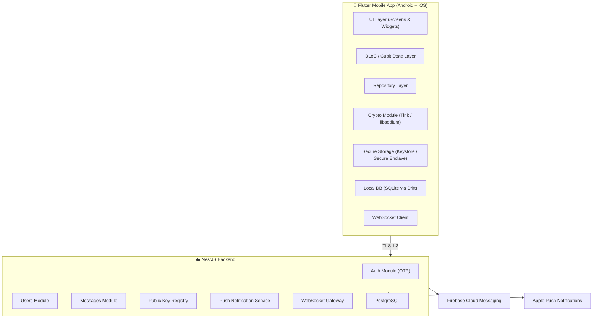

# Gizmo – Structural Implementation Plan
## Secure End-to-End Encrypted Mobile Messaging Application

Gizmo is a production-ready, cross-platform mobile messaging app (Flutter) backed by a Node.js/NestJS server. Users register with their phone number, send plaintext or manually-encrypted messages, and decrypt messages locally — the server never touches plaintext or private keys.

---

## High-Level Architecture



---

## Phase 1 — Project Scaffolding & Monorepo Setup

### Repository Layout

```
gizmo/
├── mobile/          # Flutter app
├── backend/         # NestJS server
├── shared/          # Shared types / proto definitions
└── docs/            # Architecture & API docs
```

### Tasks
- Initialize Flutter project (`flutter create mobile --platforms android,ios`)
- Initialize NestJS project (`nest new backend`)
- Set up `shared/` for Protobuf / OpenAPI contracts
- Configure GitHub Actions CI pipeline (lint → test → build)
- Add `melos` for monorepo management (Flutter side)

---

## Phase 2 — Backend Foundation

### 2.1 Database Schema (PostgreSQL)

```
users
  id (UUID PK)
  phone_number (unique, E.164)
  display_name
  avatar_url
  public_key (base64 – current long-term key)
  public_key_version (int)
  created_at, updated_at

sessions
  id, user_id (FK), device_token, refresh_token_hash, expires_at

messages
  id (UUID PK)
  sender_id (FK users)
  receiver_id (FK users)
  ciphertext (text)
  security_level (enum: STANDARD | HIGH | MAXIMUM)
  protocol_version (text)
  ephemeral_public_key (base64, nullable)
  nonce / iv (base64)
  auth_tag (base64)
  status (enum: SENT | DELIVERED | READ)
  created_at

contacts
  owner_id, contact_id, verified (bool), safety_number_hash

```

### 2.2 NestJS Modules

| Module | Responsibility |
|---|---|
| `AuthModule` | Phone OTP flow via Firebase Auth / Twilio Verify |
| `UsersModule` | Registration, profile CRUD, public-key upload |
| `MessagesModule` | Store & route ciphertext, status updates |
| `ContactsModule` | Contact discovery by phone number |
| `KeysModule` | Serve public keys to authorized clients |
| `NotificationsModule` | FCM + APNs push delivery |
| `WebSocketGateway` | Real-time message routing, typing indicators, presence |

### 2.3 REST + WebSocket API Surface

**Auth**
- `POST /auth/send-otp` → `{ phone_number }`
- `POST /auth/verify-otp` → `{ phone_number, otp }` → `{ access_token, refresh_token }`
- `POST /auth/refresh`
- `POST /auth/logout`

**Users**
- `POST /users/register` → `{ display_name, public_key }`
- `GET /users/me`
- `PUT /users/me` (name, avatar, about)
- `GET /users/resolve?phone=+1234...` (contact discovery)
- `GET /users/:id/public-key`

**Messages**
- `POST /messages` → `{ receiver_id, ciphertext, security_level, ... }`
- `GET /messages/history/:contact_id?cursor=...` (pagination)
- `PATCH /messages/:id/status` (DELIVERED | READ)

**WebSocket Events**
- `message:send` / `message:receive`
- `message:status`
- `typing:start` / `typing:stop`
- `presence:update`

### 2.4 Security Middleware

- JWT RS256 authentication guard on all protected routes
- Rate-limiting on `/auth/*` (5 OTP attempts / 10 min)
- TLS 1.3 enforced (Nginx reverse proxy / Cloud Load Balancer)
- Helmet.js, CORS, request-size limits
- No plaintext message fields ever logged

---

## Phase 3 — Cryptography Design

> [!IMPORTANT]
> **All cryptographic operations happen client-side only.** The server is a blind relay.

### 3.1 Key Hierarchy

```
Device Root Key (Android Keystore / Secure Enclave)
  └── Long-Term Identity Key Pair (X25519 / Ed25519)
        └── Ephemeral Session Keys (per-message for Maximum Security)
```

### 3.2 Security Level Mapping

| User Level | Algorithm | Key Size | Notes |
|---|---|---|---|
| Standard | AES-256-GCM | 256-bit | Symmetric, random nonce per message |
| High | ChaCha20-Poly1305 | 256-bit | Stream cipher, strong on mobile |
| Maximum | X25519-ECDH + AES-256-GCM | 256-bit | Hybrid E2E; ephemeral key per message |

### 3.3 Maximum Security — Hybrid Encryption Flow

```
Sender:
  1. Generate ephemeral X25519 key pair (e_priv, e_pub)
  2. ECDH(e_priv, receiver_long_term_pub) → shared_secret
  3. HKDF(shared_secret) → symmetric_key
  4. AES-256-GCM.encrypt(plaintext, symmetric_key, nonce) → ciphertext + tag
  5. Transmit: { e_pub, nonce, ciphertext, tag, security_level: MAXIMUM }

Receiver:
  1. ECDH(receiver_long_term_priv, e_pub) → shared_secret
  2. HKDF(shared_secret) → symmetric_key
  3. AES-256-GCM.decrypt(ciphertext, symmetric_key, nonce, tag) → plaintext
```

### 3.4 Replay Attack Protection

Each message carries a unique UUID. The client checks the local DB to reject duplicate message IDs.

### 3.5 Flutter Crypto Libraries

| Purpose | Library |
|---|---|
| AES-GCM / ChaCha20 | `pointycastle` or `cryptography` (dart) |
| X25519 / Ed25519 | `cryptography` package |
| Hardware key binding | `flutter_secure_storage` + platform Keystore/Enclave APIs via method channel |
| HKDF | `cryptography` package |

---

## Phase 4 — Secure Key Storage & Authentication

### 4.1 Key Storage Strategy

```
Android:
  ├── Long-term private key → Android Keystore (hardware-backed TEE)
  ├── Auth method: Biometric / PIN / Pattern via BiometricPrompt API
  └── KeyPermanentlyInvalidatedException handled on biometric change

iOS:
  ├── Long-term private key → Secure Enclave (kSecAttrTokenIDSecureEnclave)
  ├── Auth method: Face ID / Touch ID / Passcode via LocalAuthentication
  └── LABiometryLockout handled gracefully
```

### 4.2 Gizmo-Specific PIN/Password (Option 2)

- User sets a 6-digit PIN or password
- PBKDF2 (500,000 iterations) or Argon2id derives a KEK (Key Encryption Key)
- KEK wraps the private key in AES-256-GCM
- Wrapped key stored in `flutter_secure_storage`
- Rate-limited: 5 attempts → 30-second lockout, exponential backoff

### 4.3 Authentication Trigger Points

| Action | Auth Required |
|---|---|
| Encrypt a message | ✅ Biometric / Gizmo PIN |
| Decrypt an encrypted message | ✅ Biometric / Gizmo PIN |
| App unlock (if App Lock enabled) | ✅ |
| View key fingerprint / safety number | ✅ |
| Change security settings | ✅ |

---

## Phase 5 — Flutter Mobile Application

### 5.1 App Architecture

```
mobile/lib/
├── main.dart
├── app/
│   ├── app.dart              # MaterialApp + routing
│   ├── router.dart           # GoRouter routes
│   └── theme/               # Design system tokens
├── core/
│   ├── crypto/               # CryptoService (encrypt/decrypt)
│   ├── auth/                 # BiometricAuth, GizmoPin service
│   ├── storage/              # SecureStorage, LocalDatabase (Drift)
│   ├── network/              # ApiClient (Dio), WebSocketClient
│   └── notifications/        # FCM / APNs handler
├── features/
│   ├── onboarding/           # Registration + OTP + security setup
│   ├── conversations/        # Chat list screen
│   ├── chat/                 # Chat screen + message bubbles
│   ├── contacts/             # Contact discovery
│   ├── profile/              # User profile
│   └── settings/
│       └── security/         # Security settings screen
└── shared/
    ├── widgets/              # Reusable UI components
    └── models/               # Data models + serializers
```

### 5.2 State Management

- **BLoC / Cubit** (flutter_bloc) for all features
- Repository pattern isolating network/storage from UI
- `Equatable` for state equality

### 5.3 Key Screens

| Screen | Key Features |
|---|---|
| Splash | Auth check, deep link handling |
| Registration | Phone input → OTP verification |
| Security Setup | Device Security vs. Gizmo PIN selection |
| Conversation List | Contact avatars, last message preview (obfuscated for encrypted), unread badge |
| Chat Screen | Message bubbles, lock icon, send button, typing indicator |
| Encryption Dialog | Security level picker (Standard / High / Maximum) |
| Auth Prompt | Biometric sheet or PIN entry |
| Message Bubble (encrypted) | 🔒 Encrypted Message → tap → auth → 🔓 Decrypted |
| Contact Profile | Safety number, QR code, verification status |
| Security Settings | All toggles from spec |

### 5.4 Chat Screen Layout

```
┌─────────────────────────────────────┐
│ ← Alice                    Online  │
├─────────────────────────────────────┤
│                                     │
│  Hello!                    10:01 ✓✓ │
│                                     │
│  🔒 Encrypted Message               │
│     High Security · Tap to Decrypt  │
│                                10:02│
│                                     │
├─────────────────────────────────────┤
│ 😊  Type a message...   🔒      ➤  │
└─────────────────────────────────────┘
```

### 5.5 Notifications

- Encrypted messages: push payload contains only `message_id`, `sender_id`, security_level
- Notification display: `🔒 Encrypted Message – Open Gizmo to decrypt`
- Normal message preview hidden behind notification privacy setting

---

## Phase 6 — Identity Verification

### Safety Number

- Derived from: `SHA-256(user_A_public_key || user_B_public_key)` displayed as 60-digit fingerprint blocks
- Users compare out-of-band (phone call / in-person)

### QR Code Verification

- Encode safety number + user ID into QR
- Scan partner's QR → auto-compare → mark `contacts.verified = true`
- Display `✔ Verified Contact` badge

### Key Change Detection

- On fetching a contact's public key, compare with stored version
- If changed: display `⚠ Identity Changed — Verify this contact again`
- Block encrypted send until user explicitly re-verifies

---

## Phase 7 — Message Delivery & Sync

### Online Flow (WebSocket)
```
Sender → WS Gateway → store in DB → push to receiver WS → ACK DELIVERED
Receiver opens message → PATCH status READ → WS event to sender
```

### Offline Flow (Push Notification)
```
Receiver offline → FCM/APNs push (no plaintext) → app opens → 
REST fetch pending messages → ACK DELIVERED
```

### Message Pagination
- Cursor-based pagination (keyset on `created_at + id`)
- Local SQLite cache (Drift) as source of truth on mobile

---

## Phase 8 — Trust Indicators & UI

| State | Indicator |
|---|---|
| Transport encrypted | 🔒 End-to-End Encrypted (chat header) |
| Message encrypted (unrevealed) | 🔒 Encrypted Message |
| Message decrypted | 🔓 Decrypted |
| Contact verified | ✔ Verified Contact |
| Key changed | ⚠ Identity Changed |
| Message sent | ✓ |
| Message delivered | ✓✓ |
| Message read | 👁 |

---

## Phase 9 — Security Settings Screen

| Setting | Default |
|---|---|
| Authentication method | Device Security |
| Require auth before encrypting | ON |
| Require auth before decrypting | ON |
| Auto-lock conversations | OFF (configurable timeout) |
| Hide message preview in notifications | ON |
| Disable screenshots on sensitive screens | ON |
| App lock | OFF |
| Default security level | Standard |

---

## Phase 10 — Testing Strategy

### Backend
- Unit tests: auth service, key lookup, message storage logic
- Integration tests: OTP flow, message routing, WebSocket events
- Security tests: JWT tampering, rate-limit bypass attempts
- Tools: Jest, Supertest

### Mobile
- Unit tests: CryptoService (encrypt/decrypt round-trips per security level)
- Widget tests: Chat screen, Auth Prompt, Encryption Dialog
- Integration tests: Full send/receive flow with mock backend
- Tools: `flutter_test`, `mocktail`, `bloc_test`

### E2E
- Maestro or Patrol for full onboarding → messaging → decryption flows

---

## Delivery Milestones

| Sprint | Deliverable |
|---|---|
| 1 | Monorepo, CI/CD, DB schema, Auth API (OTP) |
| 2 | User registration, public key upload, WebSocket gateway |
| 3 | Flutter onboarding (phone → OTP → security setup), secure key generation |
| 4 | Chat UI, plaintext messaging (send/receive via WS) |
| 5 | Crypto module: Standard + High security levels, auth prompt |
| 6 | Maximum security (X25519 hybrid), key management |
| 7 | Contact discovery, identity verification (Safety Number + QR) |
| 8 | Push notifications, offline sync, message pagination |
| 9 | Security settings screen, App Lock, screenshot protection |
| 10 | Testing, hardening, documentation |

---

## Open Questions

> [!IMPORTANT]
> **OTP Provider**: Use Firebase Phone Auth or a standalone service (e.g., Twilio Verify)? Firebase is simpler but introduces a Google dependency.

> [!IMPORTANT]
> **Backend hosting**: Cloud (GCP/AWS/Azure) or self-hosted? This determines infrastructure-as-code tooling (Terraform, Docker Compose).

> [!IMPORTANT]
> **Message retention policy**: How long should ciphertext be stored server-side? Should messages be deleted after delivery?

> [!NOTE]
> **Multi-device support**: The spec implies single-device. Multi-device would require a key distribution mechanism (similar to Signal's sealed sender). Out of scope for v1?

> [!NOTE]
> **Group messaging**: Not mentioned in spec. Excluded from v1 scope?
